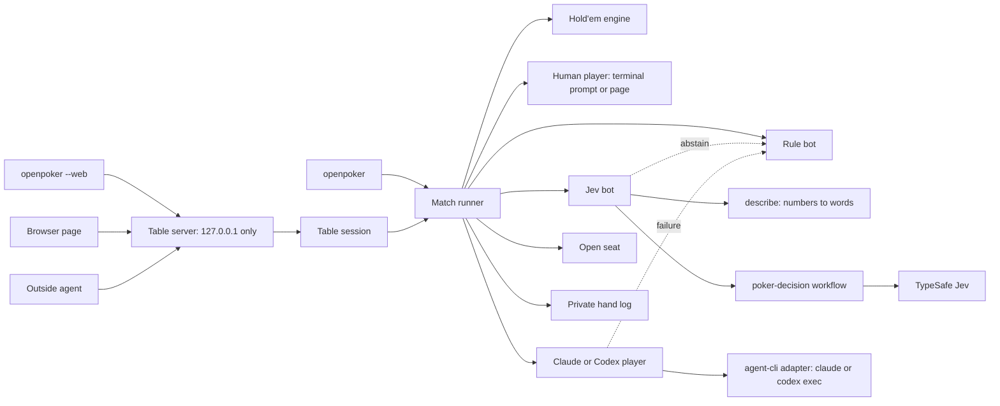

# Heads-up poker — Design Spec

- **Date:** 2026-09-30
- **Status:** Built. The browser table, the choice of players and the agent seat were added later on the same day. After that the table grew to two to six seats, with a model for each agent seat, a turn clock and `jev/poker-seat/v2`: see the [seats, models and clock spec](2026-09-30-poker-seats-models-clock.md). This document describes the two-player game as first built; where the two differ, the later spec describes the current code.
- **Context:** This is a bounded action-selection experiment. It does not serve the browser-research job.

## Goal

The host can play heads-up Texas Hold'em in the terminal against a simple maths bot or a Jev-driven bot, with play chips. The same code can run bot-against-bot matches so we can measure whether Jev's judgment adds anything over plain odds.

The same match runner also drives a card table in the browser. Each of the two seats holds one player: the host, the rule bot, Jev, a Claude or Codex command-line session, or an outside agent that answers through a small local JSON protocol. The host can play any of them or watch two of them play each other.

This follows an earlier study of Jev in a real-time game (Flappy Bird). Flappy failed first on latency; poker is turn-based, so Jev's ~0.3 s per decision is not the bottleneck and the result depends on judgment alone.

## Scope

**In:**

- Two-player no-limit Texas Hold'em with fixed blinds and play chips.
- A rule bot that compares its winning chance with the price of calling. It needs no API key.
- A `poker-decision` workflow in which Jev picks one label from the legal actions that code lists.
- `openpoker` for interactive play, and `openpoker --auto` for bot-against-bot runs. Every match writes a private hand log.
- Mirrored deals in `--auto`: every deck is played twice with the seats swapped, so card luck mostly cancels.
- `openpoker --web`: a card table in the browser, served from this machine only. It was out of scope in the first version; the host asked for it on 2026-09-30.
- A start screen with four modes and a choice of player for each seat. `--players BOTTOM,TOP` makes the same choice from the command line.
- Claude and Codex players that run through the locally installed `claude` and `codex` command-line tools.
- An open seat that any local agent can play through the `jev/poker-seat/v1` protocol. See [Agent seat protocol](#agent-seat-protocol).

**Out:**

- Any connection to a poker site, real money, or another person's game. Bots break those sites' rules.
- Tournaments and antes. A table for three to six players, with side pots, was out of scope here and was added later the same day: see the [seats, models and clock spec](2026-09-30-poker-seats-models-clock.md). `--auto` and the terminal game stay two-player.
- An MCP wrapper. MCP is deferred. A wrapper would call the same table API that the page and the seat protocol use.
- Measuring Claude, Codex or an outside agent. `--auto` accepts only the rule bot and Jev. A browser game keeps its stacks between hands and does not mirror deals, so its score is not a measurement.
- Sampling actions from Jev's probabilities (mixed strategy). See open question 1.
- Any claim that Jev plays well. Winning is a hypothesis to measure, not an acceptance criterion.

## Acceptance criteria

- Given no `TYPESAFE_API_KEY`, when the host runs `openpoker --opponent rule`, then a full match is playable and no network request is made.
- Given a Jev opponent, when it must act, then the state sent to TypeSafe contains no hole cards of the human player and no raw chip counts or card codes; it contains only named buckets.
- Given any Jev answer, when it is `unclear`, has confidence below 0.5, or fails validation (for example a label outside the legal list), then the rule bot's action is played and the decision is logged with the reason `unclear`, `low_confidence` or `invalid_response`.
- Given `openpoker --auto --opponent jev --hands 200`, when the run finishes, then every hand completes with zero illegal actions, chips are conserved in every hand, and the report gives the result in big blinds per 100 hands with a standard error, the abstention rate, how often Jev agreed with the rule bot, and the path of the private hand log.
- Given `openpoker --auto --opponent rule`, when the run finishes, then the same report is produced for rule bot against rule bot, as the noise baseline.
- Given a fixed `--seed`, when two rule-against-rule runs use it, then they deal the same cards and produce the same result.

### Browser table

- Given `openpoker --web` with no `--players` and no `--opponent`, when the page opens, then no game is running (`/state` has `status: "idle"`, `players: []` and `hand: null`) and the page shows the "Choose who plays" screen with four modes: Human vs Bots, Human vs Agents, Agents vs Agents, Agents vs Bots.
- Given the start screen, when the user picks a mode, picks a player for each seat from that mode's category and presses "Deal the cards", then the page sends `POST /new` with the two player types and that game starts.
- Given `--players` or `--opponent` on the command line, when the server starts, then that game starts at once and the start screen is skipped. "Change game" in the page header opens the screen again.
- Given a human in the bottom seat, when it is their turn, then the page shows one button for each legal action and sends only the chosen label. A label that is not legal now is refused with `ILLEGAL_ACTION` (HTTP 400) and no chips move.
- Given a human in the bottom seat, when a hand is in play, then `/state` holds the human's cards and never the top seat's cards before a showdown.
- Given a finished hand, when the page shows it, then the "Choices this hand" panel lists what each non-human seat chose, with Jev's confidence or the reason the rule bot stepped in. While the hand is in play the panel is hidden.
- Given a Jev player, when a game runs, then the TypeSafe key stays in the server process. The browser sends only an action label, a request for the next hand, or two player-type ids.
- Given a request whose `Host` header is not `127.0.0.1:PORT` or `localhost:PORT`, or a request other than `GET` that carries an `Origin` from another site, when it reaches the server, then the answer is HTTP 403.
- Given a browser match in which at least one hand was played, when it ends, is replaced or is stopped, then a private `jev/poker-match/v1` log with `mode: "web"` and the two seat types is written under `~/.openpoker/poker/`.

### Players

- Given `--players BOTTOM,TOP` naming two of `you`, `jev`, `claude`, `codex`, `bot`, `agent`, when the server starts, then those players are seated. `you` in the top seat is refused with a usage error.
- Given no human is seated, when a game runs, then the page is a spectator view: `/state` shows both hands, and ticking "Deal automatically" deals each next hand without a click.
- Given a player type that is not available (Jev without `TYPESAFE_API_KEY`; Claude or Codex when the command is not installed), when the start screen lists it, then it is marked unavailable with the reason, and `POST /new` refuses it with `PLAYER_UNAVAILABLE` (HTTP 409).

### Claude and Codex players

- Given a Claude or Codex player, when it must act, then code starts the local `claude` command (print mode, no tools, no saved session) or `codex exec` (read-only sandbox, ephemeral) once for that decision, in an empty temporary directory. The tool uses whatever account it is signed in with. This project reads and stores no key for it.
- Given the prompt sent to the tool, when it is built, then it holds that seat's own cards, the board, the chip counts, the actions so far, code's estimate of the odds and the legal labels. It never holds the other seat's cards.
- Given the tool's reply, when code reads it, then the first legal label named in it is played. `raise-small`, `Raise Small` and `raise_small` all count as `raise_small`.
- Given the tool cannot be started, reports an error or does not answer within 90 seconds, when the decision is due, then the rule bot's action is played, the decision is logged with the reason `error`, and the page shows a notice that names the seat.
- Given a reply that names no legal label, when code reads it, then the rule bot's action is played and the decision is logged as `invalid_response`. This case shows in "Choices this hand" only; the page shows no notice for it.
- Given only one legal action, when a Claude or Codex player must act, then code plays it without starting the tool.

### Open seat protocol

- Given a game with an open seat, when an agent calls `GET /seats/N/view?wait=MS`, then the answer comes at once if it is that seat's turn; otherwise it comes when the seat has something new to do or see, or after `MS` milliseconds (at most 25 000).
- Given `status: "your_turn"`, when the agent posts one label from `legal_actions`, then that action is played and logged with the source `agent`. A label outside the list is refused with `ILLEGAL_ACTION` (HTTP 400) and the turn stays open.
- Given an open seat's turn, when no answer arrives within 120 seconds, then code plays `check` if it is legal and `fold` if not, and logs the reason `timeout`.
- Given a seat view, when the hand has not reached a showdown, then it never holds the other seat's cards. `last_result.opponent_cards` is filled only after a showdown.
- Given an action with a `note`, when the server stores it, then the note is cut to 200 characters, kept in the hand log, and shown on the page as plain text only. Code never reads meaning from it.
- Given a seat that is not an open seat in the current game, when an agent calls it, then the view has `status: "seat_not_open"` and an action is refused with `SEAT_NOT_OPEN` (HTTP 409).

## Design



| File | Responsibility |
| --- | --- |
| `src/cards.mjs` | Deck, seeded shuffle |
| `src/evaluate.mjs` | Best five of seven cards, comparable score |
| `src/equity.mjs` | Monte Carlo chance of winning against a random hand |
| `src/engine.mjs` | Blinds, betting, streets, showdown, legal actions, per-seat view |
| `src/describe.mjs` | Turns one seat's view into named buckets plus numeric facts |
| `src/players.mjs` | Rule bot, Jev bot (injected decision function), model player (injected `ask` function, prompt builder, label parser), scripted player |
| `src/match.mjs` | Plays hands, alternates the button, mirrors deals, tracks results and opponent tendencies |
| `src/terminal.mjs` | Terminal prompt and display for the human seat |
| `src/table-session.mjs` | One two-seat table for the browser and for outside agents: seats the players, holds the page snapshot and each open seat's view, validates labels, applies the open-seat timeout |
| `src/server.mjs` | Local HTTP server on `127.0.0.1`: serves the page, the page routes and the seat routes; checks `Host` and `Origin` |
| `src/table.html` | The single page: start screen, cards, chips, action buttons, hand log, "Choices this hand" |
| `src/agent-cli.mjs` | Starts the local `claude` or `codex exec` command once per decision and returns its reply as text |
| `src/poker-decision.mjs` | One Choice question over the legal labels; validation and abstention policy |
| `src/cli.mjs` | `openpoker` arguments, player wiring, report; `--web`, `--players`, `--port`, `--claude-model`, `--codex-model` |

`src/` imports nothing from the TypeSafe client and nothing from `src/adapters/`. The Jev bot receives a decision function and the model player receives an `ask` function, so the engine is testable offline and the workflow stays the only place that talks to Jev.

**Actions.** Code lists the legal labels for each decision from `fold`, `check`, `call`, `raise_small`, `raise_large`, `all_in`. Code maps `raise_small` to a raise of half the pot and `raise_large` to a raise of the full pot, clamps both to the minimum raise and the effective stack, and removes duplicates. Raises are capped at four per betting round. Jev never returns a number.

**State sent to Jev.** Only words, because the Flappy study showed raw numbers mislead Jev: hand strength, the made hand's name, the price of calling, whether calling pays on the numbers, the street, position, stack depth, the opponent's last action, and the opponent's observed tendencies. The criteria for each label contain the decision rule in plain words.

**Policy.** The workflow owns the abstention rule (`unclear`, or confidence below 0.5). The Jev bot owns the fallback to the rule bot. Both versions are recorded on every decision as `poker-decision-questions/v1` and `poker-decision-policy/v1`.

**Chips and blinds.** Every game first used 200 chips and 1/2 blinds, and the pilot below was run with those. A played game, in the terminal or the browser, now starts with 10,000 chips and 50/100 blinds. `--auto` keeps 200 chips and 1/2 blinds so new runs stay comparable with the pilot. `--stack` and `--blinds SB/BB` change either.

**Measurement.** `--auto` resets both stacks every hand and mirrors every deal. The deck uses its own random stream, so one `--seed` deals the same cards whatever the players decide; a Jev run and a rule-bot run with the same seed can be compared pair by pair. The standard error is taken over pairs of mirrored hands. Interactive games keep their stacks between hands and end when a player has no chips, and they never mirror deals, because the human would see the bot's previous cards.

**Artifacts.** Every match writes one JSON hand log to `~/.openpoker/poker/`, with mode `0600`, containing both seats' cards, every action, and every Jev probability distribution. A browser match writes the same log with `mode: "web"` and a `seats` list, once at least one hand was played. The log also keeps each agent note and the first 120 characters of each Claude or Codex reply.

**Browser table.** `openpoker --web [--port 8787]` starts one local server and prints its address. The page shows drawn cards, chips, one button for each legal action, a hand log, and a "Choices this hand" panel once a hand is over. A finished hand waits until someone asks for the next one. Browser games keep their stacks between hands and end after `--hands` hands (20 unless set) or when a player has no chips. `--web` cannot be combined with `--auto`, `--show-decisions` or `--format json`. `.claude/launch.json` holds a `poker-web` entry that runs `node ./bin/jev.mjs poker --web --port 8787`.

**Start screen and modes.** With no `--players` and no `--opponent`, the table starts idle and the page shows "Choose who plays". A mode fixes the kind of player in each seat, bottom first:

| Mode | Bottom seat | Top seat |
| --- | --- | --- |
| Human vs Bots | You | Bot |
| Human vs Agents | You | Jev, Claude, Codex or Open seat |
| Agents vs Agents | Jev, Claude, Codex or Open seat | Jev, Claude, Codex or Open seat |
| Agents vs Bots | Jev, Claude, Codex or Open seat | Bot |

Each entry of `player_types` in `/state` carries a `category`: `human` (You), `bot` (Bot, the rule bot) or `agent` (Jev, Claude, Codex, Open seat). "Agents" therefore means the AI players, Jev included. Modes are a grouping on the page only. The server checks just the two player types in `POST /new {"players": [bottom, top]}`, so `--players` and `/new` also accept pairs that no mode offers, such as `bot,bot`.

**Players.** The ids in `/state` and `/new` are `human`, `rule`, `jev`, `claude`, `codex` and `agent`. `--players` also takes `you` (or `me`) for `human` and `bot` for `rule`. The human sits in the bottom seat only. With `--web`, `--opponent` also takes `claude`, `codex` or `agent` and seats that player on top against you. When no human is seated the page is a spectator view: it shows both hands and offers "Deal automatically". Two players of the same type are named with a number, for example "Jev 1" and "Jev 2".

**Claude and Codex players.** `createModelPlayer` builds a plain-text brief from the seat's own view and passes it to an injected `ask` function. `src/agent-cli.mjs` supplies that function: it starts `claude` in print mode with no tools, no MCP servers and no saved session, or `codex exec` with a read-only sandbox and an ephemeral session. `--claude-model` and `--codex-model` pick the model; without them each tool uses its own default. Code takes the first legal label named in the reply. The rule that Jev sees only words does not apply here: the brief holds the seat's own card codes and chip counts.

## Agent seat protocol

This section describes `jev/poker-seat/v1`, the two-seat protocol as first built. The table now serves `jev/poker-seat/v2` for seats 0 to 5. The routes, status values and loop below still apply; the view's fields, the turn limit and the body size limit changed. See [Open seat protocol v2](2026-09-30-poker-seats-models-clock.md#open-seat-protocol-v2).

An outside agent plays an open seat over two local routes. The schema is `jev/poker-seat/v1`. Seat `0` is the bottom seat and seat `1` is the top seat. A seat is open when its player type is `agent` (shown as "Open seat").

| Route | Purpose |
| --- | --- |
| `GET /seats/N/view?wait=MS` | The seat's own view. `wait` holds the request open until the seat has something new to do or see, for at most 25 000 ms. |
| `POST /seats/N/action` | Answers the turn. The body is JSON: `{"label": "...", "note": "..."}`. `note` is optional. The reply is the seat's new view. |

| `status` | Meaning |
| --- | --- |
| `your_turn` | Answer with one label from `legal_actions`. |
| `waiting` | A hand is in play and the other seat is acting or cards are being dealt. |
| `hand_over` | The hand ended. `last_result` holds the outcome. Nothing is dealt until someone sends `POST /next`. |
| `match_over` | The match ended, or the game stopped on an error. |
| `seat_not_open` | This seat holds another player type in the current game. |
| `idle` | No game is running yet. |

A view, shortened:

```json
{
  "schema_version": "jev/poker-seat/v1",
  "seat": 1,
  "seat_name": "top",
  "status": "your_turn",
  "hand_number": 1,
  "view": {
    "hand_number": 1,
    "seat": 1,
    "is_button": false,
    "street": "preflop",
    "hole_cards": ["Jc", "Td"],
    "board": [],
    "pot": 4,
    "to_call": 0,
    "stack": 198,
    "opponent_stack": 198,
    "big_blind": 2,
    "actions": [{ "street": "preflop", "seat": 0, "label": "call", "amount": 1, "to": 2 }]
  },
  "legal_actions": [
    { "label": "check", "amount": 0, "to": 2 },
    { "label": "raise_small", "amount": 2, "to": 4 },
    { "label": "raise_large", "amount": 4, "to": 6 },
    { "label": "all_in", "amount": 198, "to": 200 }
  ],
  "situation": {
    "betting_round": "before the flop (first betting round)",
    "my_hand_strength": "medium",
    "price_to_call": "free, nothing to call",
    "my_position": "I act last in this round"
  },
  "odds": { "win_chance": 0.575, "price_to_call": 0 },
  "opponent_profile": { "decisions": 1, "raises": 0, "faced_raises": 0, "folds_to_raise": 0 },
  "last_result": null,
  "timeout_ms": 120000
}
```

`view` is the same per-seat view every built-in player gets; the full view also repeats `legal_actions`. `situation` holds the same words Jev sees, and `odds` holds code's estimate, so an agent can use cards, words or numbers. Card codes are a rank and a suit, such as `Jc` or `Td`. When it is not the seat's turn, `view`, `situation` and `odds` are `null` and `legal_actions` is empty.

An action:

```json
{ "label": "raise_small", "note": "Medium hand, free to act, small raise." }
```

**The loop.** Read the view with `wait`. On `your_turn`, post one label. On `hand_over`, read `last_result`; the next hand starts only when someone sends `POST /next` with an empty JSON body. The page does that from its button or from "Deal automatically", and an agent may send it too. Stop on `match_over`. `node examples/poker-agent.mjs --seat 1` runs a small example agent; `--url` points it at another address. The example never sends `POST /next`, so in a game with no human someone must press "Deal next hand" or tick "Deal automatically".

**Timeout.** An open seat has 120 seconds for each turn. After that code plays `check` if it is legal and `fold` if not. The limit is fixed in the CLI; there is no flag for it.

**Errors.** Every error is JSON: `{"error": "...", "code": "..."}`.

| HTTP | `code` | Cause |
| --- | --- | --- |
| 400 | `ILLEGAL_ACTION` | The label is not in `legal_actions` now |
| 400 | `INVALID_INPUT` | Unknown player type, or the human named for the top seat |
| 409 | `NOT_YOUR_TURN` | The seat has no open turn |
| 409 | `SEAT_NOT_OPEN` | The seat is not an open seat in this game |
| 409 | `NOT_WAITING` | `POST /next` when no finished hand is waiting |
| 409 | `PLAYER_UNAVAILABLE` | `POST /new` named a player type that is not available |
| 403 | none | Unknown `Host`, or a cross-site `Origin` |
| 415, 413 | none | A `POST` body that is not `application/json`, or is larger than 1024 bytes |

**The page routes.** The page uses `GET /state` (the snapshot), `GET /events` (a change signal), `POST /action {"label": "..."}` for the human seat, `POST /next` and `POST /new {"players": [bottom, top]}`. An agent that drives a browser, or a script, can play the human seat through the same routes.

**Security notes.**

- The server listens on `127.0.0.1` only. The CLI has no option to change that.
- Every request must carry a `Host` of `127.0.0.1:PORT` or `localhost:PORT`. This blocks DNS rebinding. A request other than `GET` with an `Origin` from another site is refused.
- Code checks every label against the legal list for that turn. An agent never sends a bet size, a card or a seat's state.
- `note` is untrusted text. It is cut to 200 characters and shown as plain text. A Claude or Codex reply is untrusted text too: code only searches it for a legal label, and it is kept in the hand log, not sent to the page.
- The page is served with a content security policy that allows no outside resource and no outside connection.
- The routes have no login. Any process on this machine can call any of them. `/state` is the page's view: it shows the bottom seat's cards to the human sitting there, and both hands in a spectator game. An agent in an open seat must read only `/seats/N/view`. The protocol keeps an honest agent from seeing the other hand; it does not stop a local process that chooses to read `/state`.

## Constraints and risks

- **Cost and rate.** A decision is 590–705 input tokens. The 200-hand pilot used 736 decisions and 486,247 input tokens, about $0.02 at the published price. Matches are capped at 500 hands and at 12 Jev attempts per hand.
- **Chance of winning is measured against a random hand.** That overstates strength after the opponent bets. Code subtracts a fixed 0.08 for each opponent raise in the hand, up to three. Both bots share this estimate, so the comparison stays fair, but neither plays well in absolute terms.
- **Predictability.** Jev's answers barely vary for the same input, so an observant opponent can exploit it.
- **Variance.** Poker results are noisy. With mirrored deals, rule bot against rule bot still ranged from +5.0 to +33.0 big blinds per 100 over three 200-hand runs. 200 hands cannot separate two similar bots; the report shows the standard error so the result is not over-read.
- **Private cards.** A shared state object could leak the human's cards to the bot. The engine builds each seat's view separately and a test checks the outgoing state.
- **Claude and Codex cost and speed.** Every decision starts a new command-line process and takes seconds, against Jev's ~0.3 s. Each call uses the host's own CLI account and counts against that account's usage. The game state in the prompt goes to that tool's provider. One call may run for 90 seconds before the rule bot steps in. There is no separate call budget for these players beyond the length of the match.
- **Sign-in is not checked up front.** A Claude or Codex player counts as available when its command answers `--version`. A signed-out tool, or a model the account cannot use, fails at the first decision: the rule bot plays that seat and the page shows a notice.
- **Temporary directories.** Each Claude or Codex player makes one empty directory under the system temporary folder for each game. The game does not remove it.
- **Open seat timing.** An agent that stops answering costs 120 seconds a turn before the safe action is played.
- **No login on the local routes.** See the security notes in [Agent seat protocol](#agent-seat-protocol).

## Verification

- `tests/poker.test.mjs`: hand ranking (wheel straight, kicker ties, flush over straight, full house over flush), chip conservation over seeded random matches, legal-action rules, the abstention policy with a mocked client, and the hole-card leak check.
- `npm run check` must keep every earlier test passing.
- Manual: a scripted interactive session through the CLI, a rule-against-rule baseline, and a 200-hand Jev-against-rule run.

### Browser table and players, 2026-09-30

- `npm run check`: 90 tests pass, 0 fail, with five opt-in browser tests skipped (95 total).
- The page was opened in a browser against the Jev opponent. Cards, chips and action buttons rendered correctly.
- The start screen was checked in a browser: Human vs Agents dealt a hand against Jev through to a showdown, and Agents vs Bots showed Jev against the rule bot with both hands face up.
- Each action by a player other than the person at the page raises a motion alert beside that seat (a callout, a glow on the cards, and the chip sliding in). It was seen in the browser for the rule bot's actions. It respects the reduced-motion setting.
- `tests/poker-web.test.mjs` (14 tests) covers the table session, the server and the adapter: hidden cards in every snapshot of a full match, illegal and out-of-turn actions, Host, Origin and content-type refusals, the open seat's view, notes and timeout, spectator games, a failing model seat, label parsing, the Claude and Codex command lines with a fake process, and the example agent run as a real child process.
- **Claude, verified live.** After the host signed in to the `claude` CLI, one hand against the Claude player ended in a showdown with four of four decisions made by Claude and no rule-bot stand-ins. Each decision took about three seconds.
- **Known gap: the Codex player is not verified live.** The local `codex` CLI's configured default model was rejected for the signed-in account. Start the table with `--codex-model` set to a model the account supports, play a few hands, and confirm that "Choices this hand" shows Codex's own choices and the page shows no notice.
- Not built at that point: a table for three or more players, and an MCP wrapper. The larger table was built later the same day; see the [seats, models and clock spec](2026-09-30-poker-seats-models-clock.md#verification). The MCP wrapper is still not built.

### Pilot results, 2026-09-30

These are pilot evidence from one machine. They validate the contract and the measurement path, not poker skill.

| Run (200 mirrored hands) | Seat 1 result, big blinds per 100 | Illegal actions |
| --- | --- | --- |
| Rule bot against rule bot, seed 21 | +16.5 ± 19.6 | 0 |
| Rule bot against rule bot, seed 22 | +5.0 ± 29.4 | 0 |
| Rule bot against rule bot, seed 23 | +33.0 ± 50.3 | 0 |
| Jev against rule bot, seed 21 | +47.0 ± 41.8 | 0 |

- **Same deals, Jev in place of the rule bot.** Seed 21 dealt identical cards in both runs. Over the 100 mirrored pairs, Jev scored +30.5 ± 42.1 big blinds per 100 more than the rule bot did in the same seat. That is less than one standard error from zero: 200 hands cannot separate them.
- **How noisy 200 hands are.** An earlier Jev run on a different deal stream scored −26.0 ± 20.1, the opposite sign. The three baselines above all favour seat 1, but 12,000 pooled rule-against-rule hands (24 library runs of 500) gave +2.6 ± 3.4, so the engine has no seat bias and the streak is chance.
- **Abstentions.** Jev was asked 741 times and played 715 decisions; the rule bot stepped in 26 times (3.5%: 24 low confidence, 2 `unclear`). Median latency was 274 ms and the run used 489,587 input tokens.
- **Agreement.** Jev chose the same action as the rule bot in 96.2% of the decisions it played. Of the 27 differences, 12 were a call where calling was described as "about break-even". The `call` criterion says to call there, while the rule bot folds below a 0.03 margin. Those differences come from the wording of the criteria, not from Jev's judgment.
- **Opponent tendencies were not exercised.** The rule bot never folded often enough to be described as "folds often".
- **Hand-written probe.** A separate 16-case probe matched the intended action 16 of 16 times, including a small raise with a medium hand against an opponent who "folds often". One case ("strong, fair price, clearly worth it") split between a small raise and a call at confidence 0.46 and abstained, which is the intended behaviour on a two-way decision.

## Open questions

1. Should the Jev bot sample from its probabilities instead of always taking the top label? The probabilities express certainty, not a bluffing frequency, so this needs its own test.
2. Does the opponent-tendency description change Jev's play enough to matter? It needs an opponent with a visible habit, such as the human or a bot that folds too much, and several thousand hands.
3. Should a later question version align the `call` criterion with the rule bot's threshold? Then every remaining difference would be a judgment call, such as acting on the opponent's tendencies. `poker-decision-questions/v2` now exists, but it is the wording for a hand with more than two players and leaves this criterion's threshold as it is.
4. Resolved 2026-09-30: the browser table was built at the host's request. The follow-up question, a table for three or more players, was also resolved on 2026-09-30: the host asked for it and it was built. See the [seats, models and clock spec](2026-09-30-poker-seats-models-clock.md).
5. Do Claude or Codex play differently enough from the rule bot to be worth measuring? `--auto` would have to accept them first, and each decision takes seconds.
